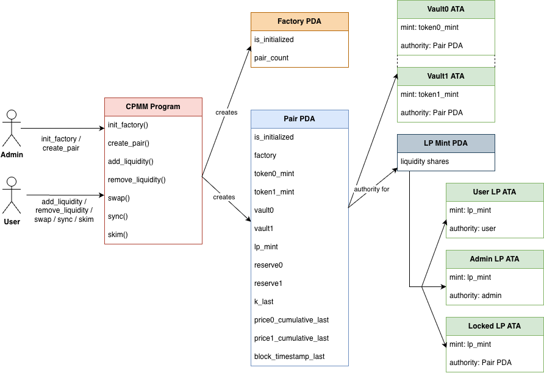

<h1 align="center">Solana CPMM Program</h1>

<p align="center">
  <a href="https://github.com/hieutrinh02/solana-cpmm-program/blob/main/LICENSE">
    
  </a>
  
  
  
</p>

## ✨ Overview

This repository contains a constant product market maker (CPMM) implementation on Solana, written in native Rust.

The goal of this project is to explore:

- Program Derived Addresses (PDAs)
- Associated Token Accounts (ATAs)
- SPL token interactions
- Constant product AMM mechanics
- Reserve synchronization and TWAP accounting
- Secure account validation in native Solana programs

The focus of this project is program correctness, safety, and clean account design.
For read-side indexing and local UI interaction, see [`solana-cpmm-indexer`](https://github.com/hieutrinh02/solana-cpmm-indexer) and [`solana-cpmm-fe`](https://github.com/hieutrinh02/solana-cpmm-fe).

## 🌐 Deployed Program

Devnet

- Program ID: `9diuYeEwSQWhagiV4nMDEPhm2fkheSnjqDPYwRZTSdsq`
- Explorer: https://solscan.io/account/9diuYeEwSQWhagiV4nMDEPhm2fkheSnjqDPYwRZTSdsq?cluster=devnet

## 📄 High-level protocol design

<p align="center">
  
</p>

### Design highlights

- **Factory PDA**: Singleton protocol state that tracks pair creation.
- **Pair PDA**: Stores canonical pair state, reserves, LP mint, vaults, and TWAP fields.
- **Vault ATAs**: Token vaults owned by the Pair PDA, one for each side of the pool.
- **LP Mint PDA**: SPL mint representing liquidity provider ownership shares.
- **Locked LP ATA**: Permanently holds `MINIMUM_LIQUIDITY` to prevent edge cases around zero-liquidity initialization.
- **Admin Fee Recipient**: Receives protocol fee LP shares when `k` growth triggers fee minting.

## 🚀 Features

- **InitFactory**
  - Creates the singleton factory PDA.
  - Restricts initialization to the configured admin authority.

- **CreatePair**
  - Creates a new pair PDA for a canonically sorted mint pair.
  - Creates the vault ATAs owned by the pair.
  - Creates the LP mint PDA.
  - Restricts creation to the configured admin authority.

- **AddLiquidity**
  - Bootstraps initial liquidity.
  - Mints LP shares to the liquidity provider.
  - Locks `MINIMUM_LIQUIDITY` to the pair-owned LP ATA.
  - Mints protocol fee LP shares when applicable.

- **RemoveLiquidity**
  - Burns LP shares and returns underlying assets pro-rata.
  - Mints protocol fee LP shares before burn when applicable.
  - Creates destination token ATAs for the payer if needed.

- **Swap**
  - Executes constant product swaps using observed vault balances.
  - Preserves the invariant after fee-adjusted input accounting.
  - Updates TWAP accumulators from elapsed time and previous reserves.

- **Sync**
  - Refreshes stored reserves from live vault balances.
  - Updates cumulative price fields used for TWAP tracking.

- **Skim**
  - Transfers excess vault balances above cached reserves to a recipient.
  - Creates recipient token ATAs if needed.

## 🔐 Invariants

The protocol is designed and tested against the following core invariants:

- Reserve consistency: After `add_liquidity`, `remove_liquidity`, `swap`, and `sync`, the stored pair reserves must match the intended post-instruction vault balances.
- Constant product safety: For swaps, the fee-adjusted constant product invariant must not be violated.
- Canonical pair identity: A pair must always correspond to exactly one canonically sorted mint pair under the factory.
- LP share accounting: LP supply must reflect liquidity ownership correctly, with `MINIMUM_LIQUIDITY` permanently locked.
- Protocol fee correctness: Protocol fee LP minting may only occur when pool growth increases `sqrt(k)` relative to `k_last`.
- TWAP monotonicity: `price0_cumulative_last` and `price1_cumulative_last` must only move forward as time advances.
- Pair state integrity: `factory`, `token0_mint`, `token1_mint`, `vault0`, `vault1`, and `lp_mint` stored in pair state must remain internally consistent.

## 🛡️ Security Defenses

The current implementation includes the following defensive measures and hardening checks:

- Admin-gated setup: `InitFactory` and `CreatePair` are restricted to the configured protocol admin authority.
- PDA derivation checks: factory, pair, and LP mint addresses are re-derived onchain and rejected if account inputs do not match expected seeds.
- Internal linkage validation: instructions verify that `factory`, `vault0`, `vault1`, and `lp_mint` stored in pair state match the accounts supplied to the instruction.
- Program ownership validation: pair state must be owned by this program, while SPL mint must be owned by the expected token program.
- Token account validation: vaults and user token accounts are unpacked and checked against expected mint and authority, reducing account substitution risk.
- Prefunded account hardening: program-owned PDAs and PDA-derived mint accounts are created through a claim-or-create path that tolerates prefunded system-owned blank accounts.
- ATA prefund recovery: ATA creation uses the idempotent ATA path so prefunded blank ATA addresses do not break instruction execution.
- Extensive negative-path tests: the suite covers invalid PDAs, ATA mismatches, owner mismatches, factory mismatches, sysvar/program mismatches, and signer failures.

## 🧪 Test Coverage

The codebase includes:

- Happy path tests for all instructions
- Negative-path tests for authorization failures
- PDA and ATA validation tests
- Protocol fee minting tests
- Reserve and TWAP update tests

Total: **122 test cases**

## 🧰 Tech Stack

- Blockchain: Solana
- Program style: Native Solana Rust
- Language: Rust
- Token standard: SPL Token
- Testing VM: LiteSVM

## 🛠 Build, Test & Deploy

Prerequisites

- Rust stable toolchain
- Solana toolchain with `cargo build-sbf`
- A funded Solana keypair for devnet deployment

From within the program folder:

```bash
cargo build-sbf
```

Run tests

```bash
cargo test
```

Switch the Solana CLI to devnet and confirm the deployer wallet:

```bash
solana config set --url devnet
solana address
solana balance
```

If needed, request devnet SOL:

```bash
solana airdrop 2
```

Deploy the program:

```bash
solana program deploy target/deploy/solana_cpmm_program.so
```

Inspect the deployed program id:

```bash
solana address -k target/deploy/solana_cpmm_program-keypair.json
solana program show <PROGRAM_ID>
```

Notes

- The compiled deploy artifact is `target/deploy/solana_cpmm_program.so`.
- The deploy keypair is `target/deploy/solana_cpmm_program-keypair.json`.
- The program id above is the value later used by offchain scripts, indexer config, and frontend config.

## ⚠️ Disclaimer

This code is for educational purposes only, has not been audited, and is provided without any warranties or guarantees.

## 📜 License

This project is licensed under the MIT License.
